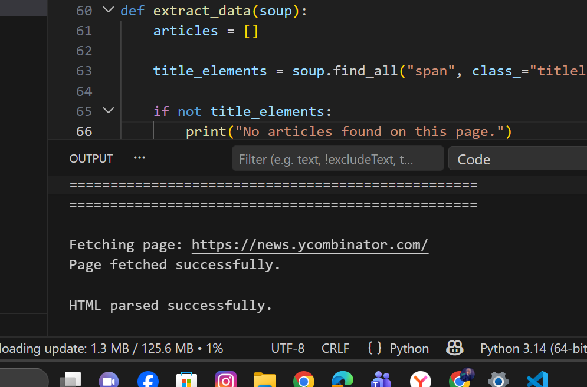
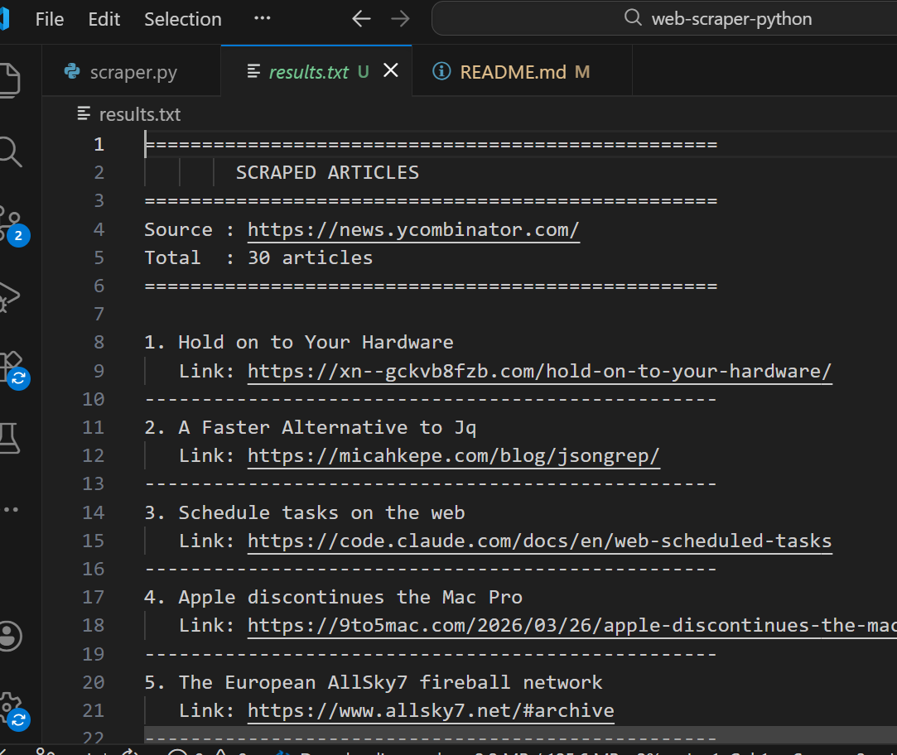

# Web Scraper in Python

A simple web scraper built in Python. It fetches the Hacker News homepage, extracts all article titles and links, displays them in the terminal, and saves them to a text file. My first Python project after building seven C projects.

---

## Screenshots





---

## Why I Built This

All my previous projects were in C — games, record systems, a banking system. This was my first Python project and I wanted to build something that felt genuinely useful. A web scraper fetches real live data from the internet every time you run it. That felt like a big step up from programs that only work with data you type in yourself.

It also introduced me to two libraries I had heard about but never used — `requests` for HTTP and `BeautifulSoup` for parsing HTML. Understanding how a webpage is structured and how to extract specific pieces of it was a completely new kind of problem for me.

---

## What the Program Does

- Sends an HTTP GET request to Hacker News
- Handles connection errors, timeouts, and bad responses cleanly
- Parses the HTML using BeautifulSoup
- Extracts all article titles and their links
- Displays every article in the terminal with its number and link
- Saves all results to `results.txt` automatically
- Every run fetches fresh live data — results change every time

---

## How to Run It

**Step 1 — Install dependencies:**
```bash
pip install requests beautifulsoup4
```

**Step 2 — Run the scraper:**
```bash
python scraper.py
```

**Step 3 — Check the output file:**

A file called `results.txt` will appear in the same folder. Open it to see all articles saved with their links.

---

## Example Output

```
==================================================
         PYTHON WEB SCRAPER
==================================================

Fetching page: https://news.ycombinator.com/
Page fetched successfully.

HTML parsed successfully.

Extracted 30 articles.

Found 30 articles:
--------------------------------------------------
1. Some Article Title Here
   https://somelink.com
--------------------------------------------------
2. Another Article Title
   https://anotherlink.com
--------------------------------------------------

Results saved to 'results.txt' successfully.
Done! Open 'results.txt' to see the saved results.
==================================================
```

---

## How I Built It — 4 Commit History

**Commit 1 — Project setup and HTTP request**
Created `scraper.py` and wrote `fetch_page()` using the `requests` library. Added three `try/except` blocks — one for connection errors, one for timeouts, and one for anything unexpected. Checked `status_code == 200` before returning the response. Added a temporary debug print of raw HTML to confirm the fetch was working — removed next commit.

**Commit 2 — HTML parsing with BeautifulSoup**
Added `from bs4 import BeautifulSoup` and wrote `parse_html()`. BeautifulSoup takes the raw messy HTML string and turns it into a searchable tree of elements. Used `soup.find("title")` to confirm the page title was being found correctly. Used `soup.find_all("a")` to count all links — just to prove the tree was searchable. Both debug lines removed next commit.

**Commit 3 — Data extraction**
Wrote `extract_data()` — the core function. Used `soup.find_all("span", class_="titleline")` to find every story container on the page. Inside each one used `element.find("a")` to get the link tag. Used `get_text()` for the title and `get("href", "")` for the URL — the empty string default prevents crashes if href is missing. Stored everything as a list of dictionaries. Printed first 5 articles as a debug check — removed next commit.

**Commit 4 — Display and save to file**
Removed all debug prints. Added `save_to_file()` using Python's `with open()` pattern — the `with` block closes the file automatically when done. Added `encoding="utf-8"` to handle special characters in titles. `main()` now displays all articles in the terminal and saves to `results.txt` at the end. Program fully working.

---

## What I Learned

**`requests.get()`** — one function call sends an HTTP request to any URL and returns the full response including status code and HTML content. Much simpler than I expected.

**`try/except`** — Python's error handling. Instead of the program crashing on a bad connection it catches the error, prints a message, and exits cleanly. I wrote separate `except` blocks for each error type so the message is always specific.

**BeautifulSoup** — turns raw HTML into a searchable object. `find()` gets the first match. `find_all()` gets every match as a list. Two functions cover almost everything you need for basic scraping.

**`get_text()` vs `get()`** — `get_text()` extracts the visible text from a tag. `get("href", "")` safely gets an HTML attribute with a fallback default. Without the default `get()` would crash if the attribute was missing.

**`with open() as file`** — Python's safe file handling. The `with` block automatically closes the file when it ends — even if an error occurs inside. Cleaner than manually calling close.

**List of dictionaries** — storing each article as `{"number": 1, "title": "...", "link": "..."}` makes the data easy to loop through, display, and write to a file in a consistent format.

---

## Project Structure

```
web-scraper-python/
├── scraper.py
├── results.txt          ← generated every time you run it
├── README.md
└── screenshots/
    ├── terminal.png
    └── results-file.png
```

---

## Dependencies

```
requests
beautifulsoup4
```

Install with:
```bash
pip install requests beautifulsoup4
```

---

## Connect

[](https://www.linkedin.com/in/muhammad-ramzan-bb63233aa/)
[](mailto:mramzan14700@gmail.com)

---

*Eighth project in my portfolio and first Python project. Built commit by commit as part of learning Python fundamentals — HTTP requests, HTML parsing, error handling, and file saving.*